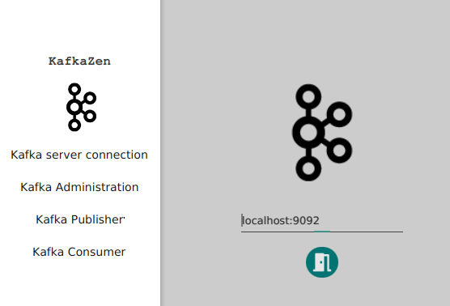

    ██ ▄█▀▄▄▄        █████▒██ ▄█▀▄▄▄      ▒███████▒▓█████  ███▄    █ 
    ██▄█▒▒████▄    ▓██   ▒ ██▄█▒▒████▄    ▒ ▒ ▒ ▄▀░▓█   ▀  ██ ▀█   █ 
    ▓███▄░▒██  ▀█▄  ▒████ ░▓███▄░▒██  ▀█▄  ░ ▒ ▄▀▒░ ▒███   ▓██  ▀█ ██▒
    ▓██ █▄░██▄▄▄▄██ ░▓█▒  ░▓██ █▄░██▄▄▄▄██   ▄▀▒   ░▒▓█  ▄ ▓██▒  ▐▌██▒
    ▒██▒ █▄▓█   ▓██▒░▒█░   ▒██▒ █▄▓█   ▓██▒▒███████▒░▒████▒▒██░   ▓██░
    ▒ ▒▒ ▓▒▒▒   ▓▒█░ ▒ ░   ▒ ▒▒ ▓▒▒▒   ▓▒█░░▒▒ ▓░▒░▒░░ ▒░ ░░ ▒░   ▒ ▒ 
    ░ ░▒ ▒░ ▒   ▒▒ ░ ░     ░ ░▒ ▒░ ▒   ▒▒ ░░░▒ ▒ ░ ▒ ░ ░  ░░ ░░   ░ ▒░
    ░ ░░ ░  ░   ▒    ░ ░   ░ ░░ ░  ░   ▒   ░ ░ ░ ░ ░   ░      ░   ░ ░ 
    ░  ░        ░  ░       ░  ░        ░  ░  ░ ░       ░  ░         ░ 
                                          ░                          

> A platform independent Kafka Client UI, written in JavaFX
> - Connect to Kafka
> - Administration
>     - delete Topics
>     - delete Consumers
>     - create Topics
> - Publish
> - Subscribe (from current or from begin) 

## Build
> **java 11 required** otherwise you will get this error `"javafx.scene.Node.getLayoutBounds()" because "this.textNode" is null`

    ./mvnw clean package
    
    
## Run

    java -jar kafkazen-1.0.0-SNAPSHOT-runner.jar
    
## Run dev

    ./mvnw clean javafx:run 
    
> To prevent GTK Warnings/Errors on GTK 2 add this property when running the application
        
        -Djdk.gtk.version=2
## Usage Kafka [`docker-compose.yml`](src/main/docker-compose.yml)
### start    
    docker-compose -f src/main/docker-compose.yml up -d
### stop    
    docker-compose -f src/main/docker-compose.yml down
### logs    
    docker-compose -f src/main/docker-compose.yml logs

